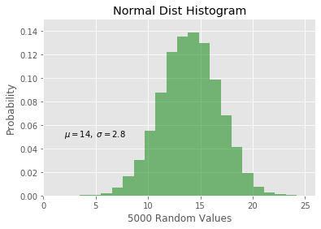
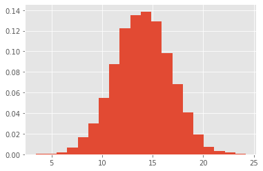
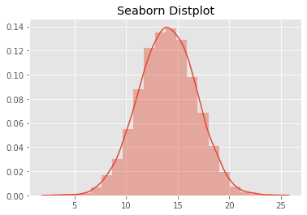

# The Normal Distribution - Lab

## Introduction

In this lab, you'll learn how to generate random normal distributions in Python. You'll learn how to visualize a histogram and build a density function using the formula. 

## Objectives
You will be able to:

* Use `numpy` to generate a random normal distribution
* Calculate the density function for normal distributions with a Python function
* Plot and interpret density plots and comment on the shape of the plot

## A quick refresher! 

Here's the formula for the normal distribution density function once more:

$$ \large N(x) = \dfrac{1}{\sigma \sqrt {2\pi }}e^{-\dfrac{(x-\mu)^2}{2\sigma^2}}$$

Here, 
- $\mu$ is the mean
- $\sigma$ is the standard deviation
- $\pi \approx 3.14159 $ 
- $ e \approx 2.71828 $


## First generate a normal distribution containing 5000 values with $\mu=14$ and $\sigma = 2.8$


```python
# Generate a random normal variable with given parameters , n=5000
import numpy as np
mu, sigma = 14, 2.8
n = 5000
s = np.random.normal(mu, sigma, n)
s
```


    array([15.76518132, 11.379243  , 15.16284558, ..., 15.92455224,
           12.14787023, 16.22206377])


## Calculate a normalized histogram for this distribution in matplotlib, with bin size = 20

Make sure to get the bin positions and counts for each of the obtained bins. You can use [official documentation](https://matplotlib.org/api/_as_gen/matplotlib.pyplot.hist.html) to view input and output options for `plt.hist()`


```python
# Calculate a histogram for above data distribution
# basic version
import matplotlib.pyplot as plt
plt.style.use('ggplot')

plt.hist(s, bins=20, density=True, alpha=0.7);
```


```python
# slightly more ADVANCED version


plt.hist(s, 20, density=True, facecolor='g', alpha=0.5)

plt.xlabel('5000 Random Values')
plt.ylabel('Probability')
plt.title('Normal Dist Histogram')
plt.text(2, .05, r'$\mu=14,\ \sigma=2.8$')
plt.xlim(0, 26)
plt.ylim(0, 0.15)
plt.grid(True)

```





## Use the formula to calculate the density function with $\mu$, $\sigma$ and bin information obtained before


```python
# Calculate the normal Density function 

bins = 20 #bins

pi = 3.14159 
e = 2.71828


d = 1/(sigma*np.sqrt(2*pi)) * np.exp(- (bins - mu)**2 / (2*sigma**2))
d
```


    0.01434324907222163


## Plot the histogram and density function


```python
# Plot histogram along with the density function

plt.hist(s, 20, density=True)
plt.plot(bins, d)
plt.show()
```





## Visualize the distribution using seaborn and plot the KDE


```python
# Use seaborn to plot the histogram with KDE
import seaborn as sns
sns.distplot(s, bins=20, kde=True)
plt.title('Seaborn Distplot')
plt.show()
```





## Summary

In this lab, you learned how to generate random normal distributions in Python using Numpy. You also calculated the density for normal distributions using the general formula as well as seaborn's KDE. Next, you'll move on to learn about the standard normal distribution and how normal distributions are used to answer analytical questions.
